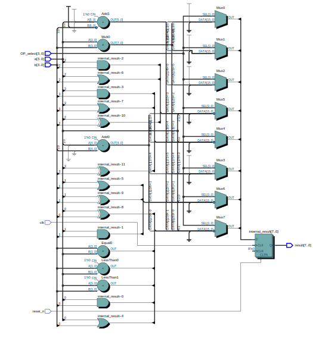

# UART 4 BIT LATCH ALU

-   

- [Read the documentation for project](docs/info.md)

## Project Description

The UART 4-BIT LATCH ALU is a digital system designed to reduce the number of inputs required for input data and minimize the number of outputs needed to obtain the output data. It comprises:

1. Dual 4-Bit Latch.
2. 4-Bit ALU.
3. UART Transmitter.

With these components, the system is capable of receiving data using 4 bits for two operands, which leaves room for using 4 bits to select which operation it's going to perform by the ALU. The output is driven by an 8-bit UART transmitter, which reduces the number of output bits needed to obtain the operation result. The data can be read using any UART interface, which is common among microcontrollers or other standalone UART interfaces.

## Block diagram

  

## Input and Output Description

| Pin Name   | Direction | Bit Number | Description                               |
|------------|-----------|------------|-------------------------------------------|
| clk        | Input     |            | Clock signal input                        |
| reset_n    | Input     |            | Reset signal input                        |
| data_input | Input     | [3:0]      | Input data to the ALU                     |
| save_a_n   | Input     |            | Save to latch A                           |
| save_b_n   | Input     |            | Save to latch B                           |
| OP_SELECT  | Input     | [3:0]      | Operation select input                    |
| uart_tx_en | Input     | [7:0]      | UART transmitter enable                   |
| uart_txd   | Output    |            | UART transmitter data output signal       |
| uartbusy   | Output    |            | UART busy indicator signal                |

## Design Components

### Dual 4-Bit Latch

  

This module serves as a 4-bit dual latch system, designed to capture and retain input data on the rising edge of the clock signal (clk). Upon activation of the save_a_n signal, data is stored in latch A, providing a mechanism for temporary data storage. Similarly, when the save_b_n signal is triggered, the module saves data in latch B, facilitating independent data storage in two separate registers. If both save signals are activated simultaneously, no data will be saved due to the NAND design which triggers the multiplexers.

In the event of a reset condition, indicated by the reset_n signal, both latches are cleared, causing the stored data to be reset to zero. It's essential to note that the use of D-type flip-flops for data storage ensures data integrity during normal operation. However, as with most volatile memory elements, data stored in the latches is lost upon power-off, as the memory contents are not persistent.
#### Simulation

Simulation was conducted using Quartus Prime Lite software, employing a 50 MHz clock with a 20 ns period for the clk signal. The remaining signals were simulated with random values.

As observed in the simulation, when the reset_n signal is high, the output q_a and q_b transition to zero, indicating that the registers have been cleared. Additionally, we can observe how values change in memory when save_a_n or save_b_n are triggered.

### UART (Universal Asynchronous Receiver/Transmitter)

  

UART is a communication protocol that operates asynchronously, eliminating the need for both devices to share a common clock signal. Instead, it relies on individual clocks on each device to synchronize data transmission. This simplicity allows UART to require only two cables: one for transmitting data (Tx) and another for receiving data. However, for successful communication, both devices must operate at the same baud rate, ensuring that data is transmitted and received at the correct speed.

In this project, a UART is only used to transmit the ALU operation result to a compatible UART device. This allows us to maintain the output with the least amount of pins, due to the constraints of the TinyTapeout template. This UART transmitter replaces two 7-segment displays, which would require 14 pins to be driven. With this transmitter, we reduce it to two signals: one to indicate if the UART is sending data, and one for the Tx signal. Our UART transmiter operates at a 9600 baudrate wich is a really coman badrate amoung UART capable devices. This UART implementation is based on ben-marshall uart project.

### Arithmetic Logic Unit (ALU)

  

The ALU performs arithmetic and logical operations on 4-bit data. Its based on regular verilog suported operators, we use 

## Possible Arithmetic Operations

The ALU can perform the following arithmetic and logical operations on input data:

1. **AND:** Performs a bitwise AND operation between the input data.
2. **OR:** Performs a bitwise OR operation between the input data.
3. **Addition:** Computes the sum of the input data.
4. **Subtraction:** Computes the difference between the input data.

## Simulation

You can simulate the design using a Verilog-compatible simulation environment. Make sure to create a comprehensive testbench to verify the correct operation of the design under different scenarios.

### Top Module

The top module integrates the 4-bit latch, UART, and ALU to create the complete design. It orchestrates the interaction between these components to achieve the desired functionality.

#### Simulation

Simulate the top module to verify the overall behavior of the design. Test various input scenarios to ensure proper data processing and communication.

## Resources Employed

- **OpenLane:** Used to automatically compile ASIC files.
- **Verilog:** Hardware description language used to implement the design.
- **Verilog Simulator:** Employed to verify the functionality of the design through simulations.

## Enable GitHub Actions to Build the Results Page

- [Activate GitHub Pages](https://tinytapeout.com/faq/#my-github-action-is-failing-on-the-pages-part)

## Additional Resources

- [FAQ](https://tinytapeout.com/faq/)
- [Digital Design Tutorials](https://tinytapeout.com/digital_design/)
- [Understanding Semiconductor Basics](https://tinytapeout.com/siliwiz/)
- [Community Engagement](https://tinytapeout.com/discord)
- [Local Design Build Instructions](https://docs.google.com/document/d/1aUUZ1jthRpg4QURIIyzlOaPWlmQzr-jBn3wZipVUPt4)

## What's Next?

- [Submit your design for the next shuttle](https://app.tinytapeout.com/).
- Update [this README](README.md) to provide details about the project's functionality, operation, and testing procedures.
- Share your project on your preferred social media platform:
  - LinkedIn [#UART4BITLATCHALU](https://www.linkedin.com/search/results/content/?keywords=%23UART4BITLATCHALU) [@TinyTapeout](https://www.linkedin.com/company/100708654/)
  - Mastodon [#UART4BITLATCHALU](https://chaos.social/tags/UART4BITLATCHALU) [@matthewvenn](https://chaos.social/@matthewvenn)
  - Twitter [#UART4BITLATCHALU](https://twitter.com/hashtag/UART4BITLATCHALU) [@matthewvenn](https://twitter.com/matthewvenn)
